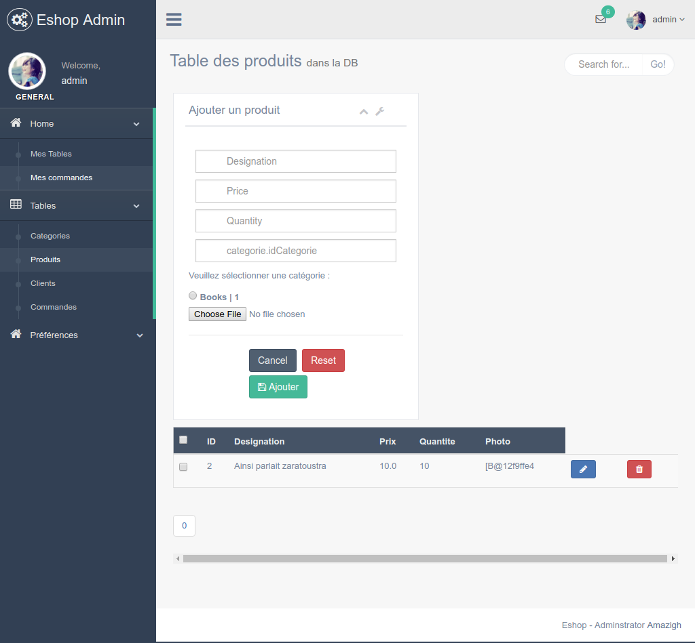

# E-Shop1.0

**Note: This project is under development.**

## App Preview
- [Admin Home page]()



## Features
  * [Java 8]()
  * [spring IoC](https://spring.io/)
  * [spring boot](https://spring.io/projects/spring-boot)
  * [spring Data JPA](https://spring.io/projects/spring-data-jpa)
  * [JPA/Hibernate]()
  * [Tymleaf](https://www.thymeleaf.org/)
  * [MySQL]()
  * [Apache Tomcat]()
  * [maeven](https://maven.apache.org/index.html)
  * [template gentelella](https://github.com/ColorlibHQ/gentelella)

## Install

  ** You muste change the file [application.properties](). Put your own DataBase, your login and password.
  You can also change the server port and the other options.
   
  ```bash
  # Clone the repo
  $ git clone https://github.com/ouramdane19/E-Shop1.0.git
  # create the database eshop2
  mysql -u root 
  CREATE  DATABASE eshop2 ;
  ```
  go to [http://localhost:8083](http://localhost:8083) in your browser
  
## Admin Credentials

* Login: admin
* password : 1234
The password can be changed after deployment to server or installation.

## License

MIT
